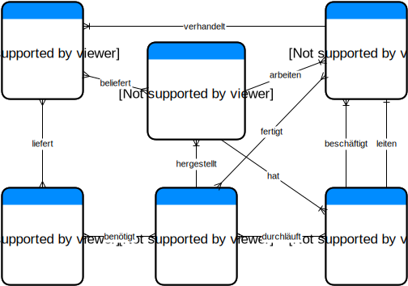

Wissensgebiet Unternehmen
=========================

Deklaratives Wissen
------------------
### Faktenwissen

* Frank Müller arbeitet in dem Unternehmen.
* Bei den Abteilungen ist der Abteilungsname interessant.
* Das Unternehmen stellt den Staubsauger __Saugermax 250__
* Für einen __Saugermax 250__ benötigen die Mitarbeiter 7 Stunden.
* Der __Saugermax 250__ bleibt eine Stunde in der Testabteilung.
* Stratman Elektronik beliefert das Unternhemen aus Köln, sie liefern Platinen.

### Relationswissen oder Regelwissen

* Mitarbeiter arbeiten in einem Unternehmen.
* In Abteilungen sind mehrere Mitarbeiter beschäftigt.
* Das Unternehmen ist in Abteilungen unterteilt.
* Im Unternehmen werden Produkte hergestellt.
* Produkte werden von Mitarbeitern gefertigt.
* Das Produkt durchläuft während der Produktion mehrere Abteilungen.
* Eine Abteilung wird von mehreren Produkten durchlaufen
* Ein Unternehmen hat mehrere Zulieferer
* Ein Mitarbeiter verhandeln mit den Zulieferern.
* Ein Teil kann von unterschiedlichen Zulieferern geliefert werden.
* Die Teile werden zur Fertigung eines Produktes benötigt.
* Ein Produkt benötigt mehrere Teile.

### Constraints

* Es gibt nur einen Abteilungsleiter je Abteilung.
* Abteilungsleiter können immer nur eine Abteilung leiten.
* Ein Mitarbeiter kann nicht gleichzeitig in mehreren Abteilungen beschäftigt sein.
* Ein Zulieferer hat genau einen Mitarbeiter als Ansprechpartner im Unternehmen.

ER-Model
--------

